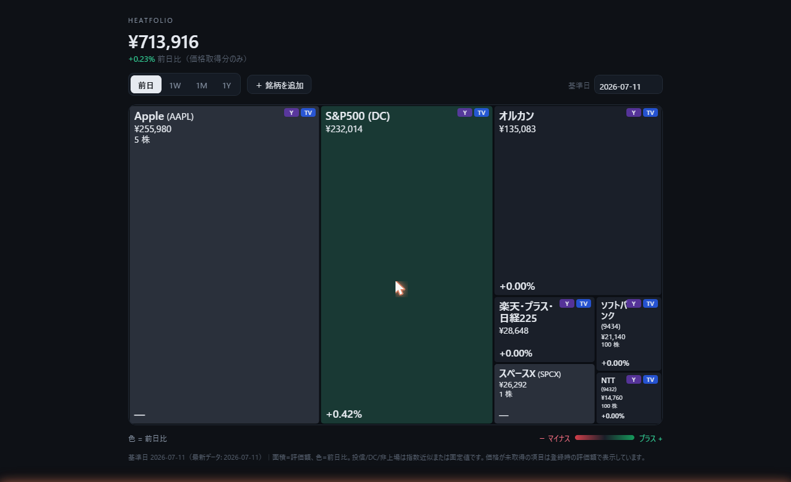

# heatfolio

**日本語** | [English](README_en.md)

保有資産を四角いタイル（treemap）で俯瞰する、**口座連携なし・パスワード不要**の自分専用ダッシュボード。
数量だけ登録しておけば、価格は日次バッチが公開ソース（Yahoo chart API）から自動取得する。
**完全ローカル運用・外部非公開**（GitHub Pages やクラウドには一切出さない）。

- 面積 = 評価額 / 色 = 騰落率（前日 / 1W / 1M / 1Y 切替、基準日を遡って表示も可）
- 証券口座の ID/PW は一切扱わない。数量は売買した日だけ直す（画面から編集できる）
- DB なし。価格履歴はローカルの JSON にたまり、それがそのまま時系列になる



（画面の Apple 5 株は demo です。銘柄名（コード）と数量、右上の Y / TV バッジで Yahoo Finance / TradingView に 1 クリックで飛べます）

## こんな人向け

**マネーフォワードや他の口座連携型ツールが便利なのは分かっているけれど、証券会社の ID/PW を第三者のアプリに預けるのがどうしても引っかかる**——という人のために作っています。

大手の家計簿・資産管理サービスでも、過去には情報流出のインシデントが起きています。真面目にセキュリティに投資している会社でさえそうなのですから、より小規模な類似サービスや無料のクラウド SaaS で「大丈夫ですよ」と言われても、そこを鵜呑みにできる根拠は個人には無い。連携先を信じる/信じないの問題ではなく、**そもそも家計データを他社に預ける前提を採用するかどうか、を選び直す話**だと思っています。

その代わり、以下のトレードオフを受け入れる必要があります:

- **数量は自分で 1 度だけ入力する**（売買した日にだけ数字を直せば済む・画面から編集できる）
- **価格の自動取得は Yahoo chart API（公開ソース）にだけ依存する**（塞がれても差し替えられる設計）
- **閲覧はこの PC、または Tailscale を張っている自分の端末だけ**
- **スマホからも見たい場合は、Tailscale アプリを入れて自分の tailnet に参加させておく手間が要る**

その手間を「安心のコスト」と割り切れる人には、案外気持ちよく使えると思います。逆に、「数量入力すら面倒、口座連携で全自動を取りたい」と自分の判断として合理的だと思える人には、既存の口座連携型ツールのほうが素直に向いています（それは正しい選択です）。

設計思想の詳細と実装の勘所は Qiita 記事に書きました:  
「[口座連携なしで、保有資産をtreemapで俯瞰するローカル完結ダッシュボードの設計](https://qiita.com/ishizakahiroshi/items/b5da260733e416085421)」

## 仕組み

```
data/holdings.json        保有（銘柄・数量・評価方法。手入力 or 画面から編集）
data/prices/history.json  価格履歴（日次バッチが自動追記）
scripts/fetch-prices.mjs  Yahoo chart API から終値取得
scripts/run-fetch.vbs     上記をウィンドウ非表示で起動する launcher（タスク用）
scripts/serve-local.pyw   ローカル配信サーバー＋保存API（127.0.0.1:8080）
index.html                上を読み、評価額を計算して treemap 描画。タイルから編集も
```

評価方法（`mode`）は3種類:

| mode | 評価額の出し方 | 用途 |
|---|---|---|
| `market` | 数量 × 価格(symbol) | 上場株（例: NTT `9432.T` / ソフトバンク `9434.T` / Apple `AAPL`） |
| `proxy`  | baseValue × 価格 ÷ 基準日の価格 | 投信/DC を指数で近似（例: オルカン→`2559.T`、DC→`^GSPC`） |
| `manual` | baseValue のまま固定 | 非上場など価格が取れないもの（例: SpaceX） |

米国株など**ドル建て**の銘柄は、`market` に加えて `currency: "USD"` を付けると
「数量 × ドル株価 × その日の USD/JPY 始値」で**円換算**する（編集画面の「通貨」で 円/米ドル を選ぶ）。
USD 建て保有があるとき、`fetch-prices.mjs` は USD/JPY 始値も `JPY=X` として日次取得する。
日本株のシンボルは `.T` が必要（例: 太陽誘電＝`6976.T`。`.T` 無しは Yahoo が 404 になる）。

## 運用構成（このマシン）

完全ローカル。次の3つで動く（いずれも外部には出ない）:

1. **価格の自動更新** — Windows タスクスケジューラ `heatfolio-fetch-prices` が平日16:05に
   `wscript.exe scripts\run-fetch.vbs`（node をウィンドウ非表示で起動）を実行し `history.json` に追記。
   黒いコンソール窓が出ないよう VBS ランチャー経由にしている（PCが落ちて逃した回は次回起動時に追いつく）
2. **ローカルサーバー** — `scripts/serve-local.pyw` が `127.0.0.1:8080` で配信＋保存API。
   ログオン時に自動起動（`HKCU\...\Run` の `heatfolio-server`）
3. **外部アクセス** — `tailscale serve --bg --https=8443 8080` が tailnet 内へ HTTPS 中継。
   `https://<このマシン>.<tailnet>.ts.net:8443/` を自分の端末（Tailscale 参加済み）から開く

PC が起動している間だけ価格取得と閲覧が動く（個人用途では許容）。

## 使い方

**閲覧**: 上記の tailnet URL をブラウザで開く（スマホは Tailscale 接続が必要）。ローカルなら `http://127.0.0.1:8080/`

**tile に出る情報**:

- 銘柄名 + 証券コード（例: `NTT (9432)` / `Apple (AAPL)`）
- 評価額（円換算後）
- 数量 + 単位（例: `100 株` / `5 株` / `13,329 口`）。単位は `type` から自動判定（国内/米国株→株、投信→口）するか、`unit` フィールドで明示指定
- 前日比 or 選択期間の騰落率
- 右上に **Yahoo Finance / TradingView へ 1 クリックで飛ぶバッジ**（`symbol` から自動でリンク先を組み立て。`.T` は Yahoo JP、指数や米国株は Yahoo US・TradingView は TSE/主要指数へ振り分け。`symbol` が無い銘柄ではバッジ非表示）

**編集**: タイルをクリックすると編集パネルが開く。銘柄名・証券コード（tile 表示用）・分類・評価方法（market/proxy/manual）・シンボル（Yahoo 用）・通貨（JPY/USD）・数量・単位・評価額を編集できる。「＋ 銘柄を追加」で新規、赤い削除ボタン（誤操作防止で 2 回押し）で削除。`data/holdings.json` を手で直してもよい

**期間切替**（前日 / 1W / 1M / 1Y）と基準日で過去も遡れる（履歴が溜まった範囲）

## 制約（正直な注意）

- **投信/DC は指数近似**。基準価額そのものではなく、連動指数の変化率で評価額をドリフトさせている。
  ズレが気になったら `baseValue` を今の実額に打ち直せば再アンカーされる
- **非上場株など価格が取れないものは自動更新なし**（`manual`）。値を変えたい時は `baseValue` を手で更新
- **DC の S&P500 は FX 無視**（USD指数のまま）。上げ下げ把握が目的なので許容
- **1W/1M/1Y は履歴が溜まるほど計算される**（始めた日から積み上がる＝過去には遡れない）
- 価格取得は `scripts/fetch-prices.mjs` の `fetchClose()` に集約。Yahoo が塞がれたらこの関数だけ差し替えれば復旧できる

## 別のマシンで一から立てる

1. Node 20+ と Python 3.7+ を用意
2. サンプルをコピーして自分用にする（実データ `holdings.json` / `history.json` は `.gitignore` 対象で公開されない）:
   ```
   cp data/holdings.example.json data/holdings.json
   cp data/prices/history.example.json data/prices/history.json
   ```
   `data/holdings.json` を自分の保有に編集（または起動後に画面の「＋ 銘柄を追加」で登録）
3. `node scripts/fetch-prices.mjs` で初回の価格を取得
4. `pythonw scripts/serve-local.pyw` でサーバー起動（常時使うなら `HKCU\...\Run` 等で自動起動に）
5. `tailscale serve --bg --https=8443 8080` で自分の tailnet にだけ限定公開
6. 平日の価格取得をタスクスケジューラに登録（このマシンでは `heatfolio-fetch-prices`）。
   黒いコンソール窓を出さないため、タスクの起動プログラムは `wscript.exe`、引数を
   `"…\scripts\run-fetch.vbs"` にする（node を直接指定すると窓が一瞬出る）

管理コマンド:

```
node scripts/fetch-prices.mjs           # 価格を取得して history.json に追記
pythonw scripts/serve-local.pyw         # ローカルサーバー手動起動
tailscale serve status                  # 外部共有の状態
tailscale serve --https=8443 off        # 外部共有を止める
```

## プライバシー（公開リポジトリでの扱い）

このリポジトリは**アプリ本体と合成サンプルのみ**を公開する。自分の保有データは公開されない:

- `data/holdings.json`（実際の保有・金額）と `data/prices/history.json`（価格履歴）は `.gitignore` 対象で**コミットされない**
- 公開されるのは `data/holdings.example.json` / `data/prices/history.example.json`（ダミー）だけ
- fork/clone した各自が自分の `holdings.json` をローカルに作って使う（上の「別のマシンで一から立てる」参照）

初回コミット前に必ず `git status` で `data/holdings.json` が追跡対象に入っていないことを確認すること。

## ライセンス

コードは MIT（同梱の `LICENSE` を参照）。保有データ（`data/holdings.json`）は
自分のローカルにのみ置き、外部（GitHub/クラウド等）へは出さないこと。
