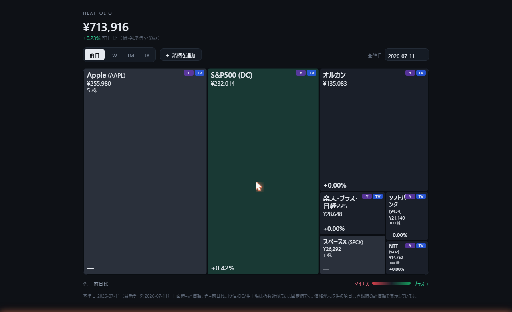

# heatfolio

**日本語** | [English](README_en.md)

保有資産を四角いタイルで俯瞰する、口座連携なし、パスワード不要のローカル専用ダッシュボードです。
面積は評価額、色は騰落率を表します。数量を自分で登録し、価格は Yahoo chart API から日次取得します。
保有データをクラウドへ送らないことを設計の中心にしています。

画面の Apple 5 株は合成サンプルです。

## 最短スタート

一般ユーザーに必要なのは Node.js 20 以上だけです。npm 公開後は次の 1 コマンドで起動できます。

\`\`\`powershell
npx --yes heatfolio@latest
\`\`\`

またはインストールして heatfolio コマンドを使えます。

\`\`\`powershell
npm install --global heatfolio
heatfolio
\`\`\`

ブラウザで http://127.0.0.1:8080/ を開き、タイルをクリックして自分の銘柄と数量に差し替えてください。
初回起動時はサンプルデータが自動で作られます。画面の保存ボタンでデータを更新できます。

公開前にこのリポジトリから試す場合は、Git と Node.js 20 以上を用意して次を実行します。

\`\`\`powershell
git clone https://github.com/ishizakahiroshi/heatfolio.git
cd heatfolio
node scripts/heatfolio.mjs serve
\`\`\`

### データの場所

アプリ本体とユーザーデータは分離されています。

\`\`\`text
%USERPROFILE%\\.heatfolio\\
  holdings.json
  prices\\history.json
\`\`\`

macOS と Linux では ~/.heatfolio/ です。現在のデータホームは次で確認できます。

\`\`\`powershell
heatfolio path
\`\`\`

環境変数 HEATFOLIO_HOME または CLI の --home <dir> で保存先を変更できます。--home が最優先です。
作者・コントリビューターがリポジトリ内の data/ を使う開発者モードは --dev または HEATFOLIO_DEV=1 です。

## 価格の更新

手動で価格を取得する場合は次を実行します。

\`\`\`powershell
heatfolio fetch
\`\`\`

履歴はデータホームの prices/history.json に追記されます。Windows のタスクスケジューラで日次実行する場合は、
プログラムを wscript.exe、引数をリポジトリ内の scripts\\run-fetch.vbs としてください。
VBS は Node CLI をウィンドウ非表示で起動し、価格データはリポジトリではなくデータホームへ書き込みます。

## 画面と評価方法

- 面積は評価額、色は前日、1W、1M、1Y の騰落率
- タイルをクリックすると銘柄名、コード、分類、評価方法、シンボル、通貨、数量、評価額を編集可能
- market: 数量 × 価格。上場株向け
- proxy: 基準額 × 価格の変化。投信、DC、指数近似向け
- manual: 基準額を固定。価格を自動取得できない資産向け

米国株などのドル建て銘柄は、market に currency: "USD" を付けます。その日の USD/JPY 始値で円換算し、
為替は JPY=X として履歴に保存します。日本株の Yahoo シンボルには .T を付けます。

## 他端末から見る

heatfolio は同じデータホームを使う 1 台の PC でサーバーを動かし、他端末はブラウザで接続してください。
Tailscale を使う場合の例です。

\`\`\`powershell
tailscale serve --bg --https=8443 8080
tailscale serve status
\`\`\`

表示された tailnet 限定 URL を、自分の Tailscale 参加端末で開きます。インターネットへ公開する構成ではありません。
複数端末で別々のサーバーを動かして JSON を手動同期すると、後の保存が先の保存を上書きする可能性があります。

## エクスポートと取り込み

- 画面上部の JSON ボタンで holdings JSON を保存できます。バックアップや別 PC への移行に使えます
- CSV ボタンで銘柄、数量、評価額、騰落率を保存できます
- CSV の形式は証券会社ごとに異なるため、取り込み UI は持たせていません。scripts/import-samples/ に変換例があります

## 開発者向け

開発時は --dev でリポジトリ内の data/ をデータホームとして使えます。

\`\`\`powershell
node scripts/heatfolio.mjs serve --dev
node scripts/heatfolio.mjs fetch --dev
\`\`\`

既存のリポジトリ内 data/holdings.json があり、データホームが空またはサンプルだけの場合、Node CLI は初回起動時にホームへコピーします。
リポジトリ側のファイルは削除しません。手動で移行する場合は次のようにします。

\`\`\`powershell
New-Item -ItemType Directory -Force $HOME\\.heatfolio\\prices
Copy-Item .\\data\\holdings.json $HOME\\.heatfolio\\holdings.json
Copy-Item .\\data\\prices\\history.json $HOME\\.heatfolio\\prices\\history.json
\`\`\`

scripts/serve-local.pyw は legacy の Python サーバーとして残しています。新規利用では heatfolio serve を使ってください。
Node CLI は静的 UI をパッケージから配信し、/data/holdings.json と /data/prices/history.json だけをデータホームから読みます。

## 制約とプライバシー

- 証券口座の ID、パスワード、口座 API は扱いません
- データベース、クラウド同期、外部ホスティングはありません
- 価格は公開ソースに依存します。取得できない日は直近価格または基準額で表示します
- 投信や DC の proxy は指数変化率による近似です
- リポジトリに含まれるのは合成サンプルだけです。実データの holdings.json と history.json は公開対象外です
- data/holdings.example.json と data/prices/history.example.json は構造確認用のサンプルです

設計の詳細は Qiita の記事「[口座連携なしで、保有資産を treemap で俯瞰するローカル完結ダッシュボードの設計](https://qiita.com/ishizakahiroshi/items/b5da260733e416085421)」にまとめています。

## ライセンス

MIT。詳細は [LICENSE](LICENSE) を参照してください。保有データは自分のローカルだけに置いてください。
